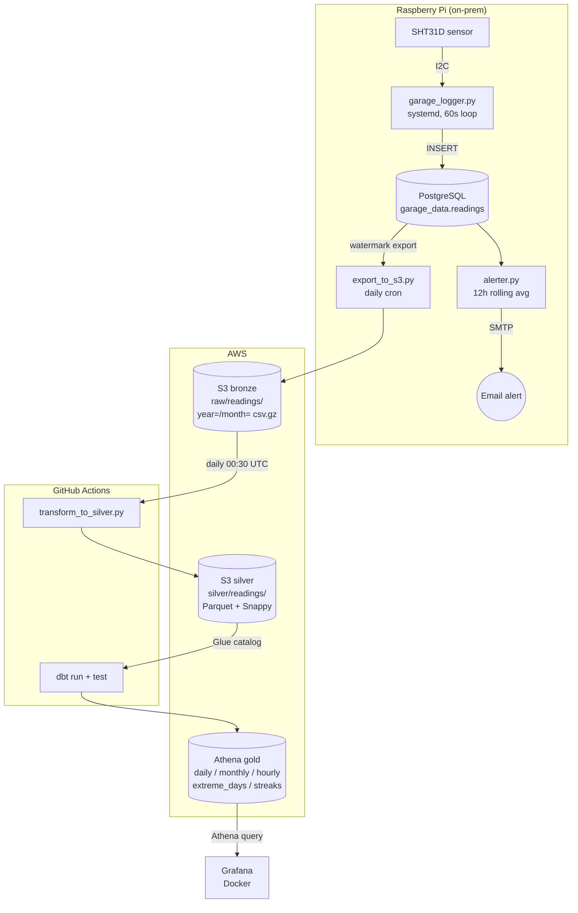

# garagewatch

> An IoT-to-Athena data pipeline on a Raspberry Pi: SHT31D sensor → PostgreSQL → S3 medallion (CSV → Parquet) → dbt on Athena → Grafana.

[](https://github.com/Travis-Magaluk/garagewatch/actions/workflows/dbt.yml)
[](https://github.com/Travis-Magaluk/garagewatch/actions/workflows/deploy.yml)
[](https://github.com/dbt-athena/dbt-athena)
[](https://aws.amazon.com/athena/)



## At a glance

- **What it does.** Captures garage temperature and humidity every 60 seconds from a real sensor, lands the data in a cloud warehouse via a medallion architecture, and surfaces it through dbt-tested marts and Grafana dashboards.
- **What's notable.** Full bronze/silver/gold pipeline running inside the AWS free tier. Real CI/CD on real hardware — GitHub Actions reach the Pi over a Tailscale tunnel and use AWS OIDC instead of static credentials.
- **Cadence.** 60-second ingest on the Pi, daily bronze export, daily silver + gold rebuild.

## Live dashboard

<!-- Screenshot to be committed: docs/images/grafana-overview.png -->
*Grafana overview (temperature + humidity, last 7 days) — screenshot coming soon.*

## Skills demonstrated

| Layer | Technology |
|---|---|
| Languages | Python 3, SQL, Bash, Jinja |
| Ingestion | I2C / SHT31D sensor, PostgreSQL, systemd |
| Storage | AWS S3 (Hive-partitioned), Parquet + Snappy, gzipped CSV |
| Transform | dbt (`dbt-athena-community`), pandas, PyArrow |
| Query / Warehouse | AWS Athena, AWS Glue Data Catalog |
| Orchestration | GitHub Actions (cron + path-triggered), AWS OIDC, Tailscale OAuth |
| Visualization | Grafana, Docker Compose |
| Practices | Medallion architecture, watermarked incremental loads, dbt data tests, freshness SLAs |

## Architecture

The pipeline implements a **medallion architecture** — raw data is progressively refined through three layers, with the edge device kept lightweight and all heavy format conversion pushed to the cloud.

**Bronze (raw).** [`scripts/garage_logger.py`](scripts/garage_logger.py) runs as a `systemd` service on the Pi. Every 60 seconds it reads the SHT31D sensor over I2C and inserts one row into a local PostgreSQL table. A daily cron runs [`scripts/export_to_s3.py`](scripts/export_to_s3.py), which uses a watermark file to pull only rows newer than the last export and writes them as gzipped CSV under `s3://garagewatch-data/raw/readings/year=YYYY/month=MM/`. CSV instead of Parquet is intentional — the Pi runs 32-bit Python, so PyArrow can't be installed; that story is in [`docs/learnings/pyarrow-32bit.md`](docs/learnings/pyarrow-32bit.md).

**Silver (cleaned).** [`scripts/transform_to_silver.py`](scripts/transform_to_silver.py) runs in GitHub Actions on a daily schedule (00:30 UTC, after the Pi export). It reads new bronze CSV files, deduplicates and sorts by timestamp, normalizes timezone (Athena `TIMESTAMP` doesn't carry zone info), and writes Parquet (Snappy) to `s3://garagewatch-data/silver/readings/`. The job runs against AWS via short-lived OIDC credentials — no static keys live in GitHub secrets.

**Gold (analytics).** The [`dbt/`](dbt/) project (using `dbt-athena-community`) builds five marts on top of a `stg_readings` staging view:

| Mart | What it answers |
|---|---|
| `daily_summary` | Min / max / avg temp and humidity per local calendar day |
| `monthly_summary` | Monthly aggregates with p25 / p50 / p75 percentiles |
| `hourly_profile` | Average temp and humidity by hour-of-day × month (seasonality heatmap) |
| `extreme_days` | Top 15 coldest, hottest, and most humid days in the trailing 12 months |
| `humidity_streaks` | Continuous high-humidity windows ≥ 60% lasting ≥ 1 hour (gaps-and-islands) |

Data quality is enforced by dbt schema tests plus a singular test ([`dbt/tests/assert_no_recent_gaps.sql`](dbt/tests/assert_no_recent_gaps.sql)) that fails the build if the sensor stream has > 2-hour gaps in the last 7 days. Source freshness SLAs (warn 2h, error 6h) catch silent logger failures.

**Visualization.** [`grafana/`](grafana/) provisions a containerized Grafana with the Athena datasource plugin and dashboards that query the gold marts directly.

## Repository tour

```
.
├── scripts/                       # Python pipeline code
│   ├── garage_logger.py           # Pi-side sensor loop (systemd service)
│   ├── alerter.py                 # 12-hour rolling humidity → SMTP alert
│   ├── export_to_s3.py            # Bronze: Postgres → S3 CSV (watermarked)
│   ├── transform_to_silver.py     # Silver: CSV → Parquet (runs in CI)
│   └── github_webhook.py          # Superseded — see "Known limitations"
├── dbt/                           # Gold layer: dbt-athena project
│   ├── models/staging/            # stg_readings (cleaned view)
│   ├── models/marts/              # 5 marts (daily / monthly / hourly / extremes / streaks)
│   └── tests/                     # Singular dbt tests (e.g. recent-gap detection)
├── .github/workflows/
│   ├── deploy.yml                 # Tailscale → SSH → restart Pi systemd service
│   └── dbt.yml                    # Daily OIDC → silver transform → dbt run/test
├── grafana/                       # Dockerized Grafana + Athena datasource
└── docs/                          # Deep-dives and learnings
    └── learnings/                 # Interview-ready writeups of real problems
```

## Continuous deployment

Two GitHub Actions workflows automate the entire pipeline:

- **[`deploy.yml`](.github/workflows/deploy.yml)** — triggered by pushes to the Pi-side scripts. Uses Tailscale OAuth to establish a private tunnel to the home network (no public IP exposure, no port-forwarding), SSHes into the Pi, pulls the latest code, and restarts the `garage_logger` systemd service. Fails fast (`set -euo pipefail`) and verifies the service is active before exiting.
- **[`dbt.yml`](.github/workflows/dbt.yml)** — runs daily at 00:30 UTC and on any change to `dbt/` or `transform_to_silver.py`. Assumes an AWS role via OIDC (zero long-lived credentials), runs the silver transform, then `dbt run` and `dbt test` against Athena.

## Run it yourself

**Explore the data models — no AWS required:**

```bash
git clone git@github.com:Travis-Magaluk/garagewatch.git
cd garagewatch/dbt
pip install dbt-athena-community
dbt compile                         # Renders the SQL with Jinja so you can read each model
dbt docs generate && dbt docs serve # Browseable lineage DAG at localhost:8080
```

**Run the full pipeline** requires a Raspberry Pi with an SHT31D sensor wired over I2C, a local PostgreSQL, and an AWS account with S3 + Athena + Glue. A reproduction guide (hardware BOM, wiring diagram, systemd unit, AWS bootstrap) is on the roadmap.

## Engineering learnings

Short, interview-ready writeups of real problems hit during the build:

- **[Parquet on a Pi — the wheel that wasn't there](docs/learnings/pyarrow-32bit.md)** — How a 32-bit Python interpreter on 64-bit hardware sent me down a build-from-source rabbit hole, and how the right answer was to change the architecture, not fight the toolchain.
- **[The S3 free-tier overage](docs/learnings/s3-cost-optimization.md)** — How an innocent-looking hourly cron blew through the AWS free tier, with the math on the API-call budget and the per-partition watermark refactor that fixes it at scale.

## Known limitations and roadmap

**Webhook deploy (superseded).** [`scripts/github_webhook.py`](scripts/github_webhook.py) is a Flask HMAC-validated webhook receiver I built as the first deploy mechanism. Once I added the `deploy.yml` GitHub Actions workflow with Tailscale OAuth, the webhook became redundant — the Actions path centralizes secrets, gives me audit logs, and removes a long-running Flask process from the Pi. I kept the file in-tree as a reference implementation of HMAC verification; production deploys now go through Actions.

**Roadmap:**

- Re-flash the Pi to 64-bit Raspberry Pi OS so Parquet can be written at the edge (currently deferred — the cloud-side conversion is working well).
- Per-partition watermark in `transform_to_silver.py` to avoid re-reading old bronze files when partitions accumulate (design sketched in [the cost writeup](docs/learnings/s3-cost-optimization.md)).
- Anomaly detection on the gold layer — currently only threshold-based humidity alerts via [`alerter.py`](scripts/alerter.py).
- Add deep-dive docs for architecture, dbt models, CI/CD, dashboards, and Pi setup under `docs/`.

## Contact

Built by Travis Magaluk — [twmagalu@gmail.com](mailto:twmagalu@gmail.com).
