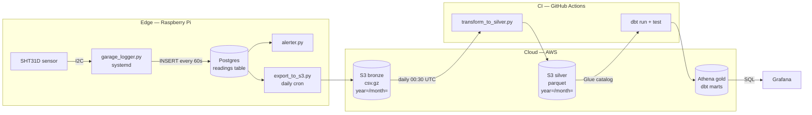

# Architecture

This pipeline implements a **medallion architecture** — raw data is captured at the edge, then progressively refined through three layers in the cloud. The guiding principle is that the Raspberry Pi stays lightweight (it only writes rows and pushes raw files), and all heavy format conversion and analytics happen in cloud services that scale and bill on usage.



## Bronze — raw capture

**Sensor loop.** [`scripts/garage_logger.py`](../scripts/garage_logger.py) is the only code that runs on the Pi as a persistent service. It opens the I2C bus once with `busio.I2C(board.SCL, board.SDA)` and reads `adafruit_sht31d.SHT31D` in a 60-second loop. Each iteration computes Fahrenheit from the Celsius reading and writes one row:

```sql
INSERT INTO readings (timestamp, temperature_c, temperature_f, humidity_percent)
VALUES (%s, %s, %s, %s);
```

The loop is wrapped in defensive logic: the Postgres connection is recreated if `conn.closed`, sensor init retries every 5 seconds on failure, and `psycopg2.OperationalError` doesn't kill the process. Logs go both to stdout (captured by `journalctl`) and to a rotating file handler (1 MB × 3 backups) under `logs/`.

**Why Postgres on the Pi rather than writing straight to S3?** Three reasons. (1) The Pi has intermittent connectivity; a local database absorbs outages without losing readings. (2) Postgres gives the alerter a queryable history for its 12-hour rolling average without me having to maintain an in-memory buffer. (3) The export job batches readings — one S3 PUT per day instead of one per minute — which is dramatically cheaper, as [the cost writeup](learnings/s3-cost-optimization.md) explains.

**Bronze export.** [`scripts/export_to_s3.py`](../scripts/export_to_s3.py) runs daily via cron. It implements the classic **watermark pattern**:

1. `get_watermark(s3)` reads `s3://garagewatch-data/watermark.json` for the `last_exported_timestamp`.
2. `fetch_rows(watermark_ts)` queries `WHERE timestamp > %s` to get only new rows.
3. Rows are grouped by `(year, month)` and written as gzipped CSV with Hive-style partitioning: `raw/readings/year=YYYY/month=MM/readings_<utc>.csv.gz`.
4. `update_watermark(s3, max_ts)` advances the watermark to the highest timestamp in the batch.

CSV instead of Parquet is the deliberate edge-vs-cloud trade-off — the Pi runs 32-bit Python, where PyArrow has no wheels and source builds cascade into toolchain conflicts. See [`docs/learnings/pyarrow-32bit.md`](learnings/pyarrow-32bit.md) for the full story; the short version is: do the format conversion in the cloud where it scales and the toolchain is sane.

## Silver — cleaned columnar storage

[`scripts/transform_to_silver.py`](../scripts/transform_to_silver.py) runs in GitHub Actions, on a schedule (daily at 00:30 UTC) and on pushes that touch `dbt/` or the script itself. It also uses a watermark, but instead of a timestamp it tracks the **last processed S3 object key**:

1. Read `silver_watermark.json` for `last_key`.
2. List bronze objects with `key > last_key`.
3. For each affected `(year, month)` partition, re-read **all** bronze files for that partition, concatenate, drop duplicates on `timestamp`, sort, and write a single Parquet file with Snappy compression to `silver/readings/year=YYYY/month=MM/readings_YYYYMM.parquet`.
4. Strip timezone info before writing — Athena's `TIMESTAMP` type does not carry a zone and rejects tz-aware values.
5. Update the watermark to the last bronze key in the batch.

**Known inefficiency.** Step 3 re-reads every bronze file in the affected partition on each run, which becomes wasteful as partitions accumulate. The fix — a per-partition watermark — is fully designed in [the cost writeup](learnings/s3-cost-optimization.md); it's deferred because the current run cost is negligible.

**Why a separate silver layer?** Athena scans Parquet roughly 5–10× faster than gzipped CSV at this volume, and Snappy decompression is cheap. More importantly, silver is where deduplication and ordering live — bronze is append-only, while silver guarantees one row per timestamp. dbt then sits on a clean, predictable foundation.

## Gold — analytics marts

The [`dbt/`](../dbt) project (`dbt-athena-community` adapter) defines six models in two layers:

| Layer | Model | Materialization |
|---|---|---|
| staging | `stg_readings` | view |
| marts | `daily_summary` | table |
| marts | `monthly_summary` | table |
| marts | `hourly_profile` | table |
| marts | `extreme_days` | table |
| marts | `humidity_streaks` | table |

Materialization defaults are set in [`dbt/dbt_project.yml`](../dbt/dbt_project.yml): staging is `view` (cheap, always fresh, never scanned at query time), marts are `table` (materialized as Parquet on S3, so Grafana panels don't pay for re-aggregating millions of readings on every refresh).

`stg_readings` is the single seam between source data and the marts. It casts columns to explicit types, exposes a `read_at_local` column converted to `America/New_York`, and filters out physically impossible sensor values:

```sql
where temperature_c between -20 and 60
  and humidity_percent between 0 and 100
  and timestamp is not null
```

Every mart `ref('stg_readings')` — none touch the raw source — so a single change to the cleaning rules propagates everywhere. Per-model details and the lineage DAG are in [`docs/dbt-models.md`](dbt-models.md).

## Visualization

Grafana runs in a single Docker Compose service ([`grafana/docker-compose.yml`](../grafana/docker-compose.yml)) with two provisioned datasources:

- **GarageDB** — local Postgres on the Pi, used for current-state panels (latest reading, data freshness) where round-tripping through S3 + Athena would be unnecessary latency.
- **GarageAthena** — the `grafana-athena-datasource` plugin pointed at the `garagewatch_analytics` database. All historical and aggregate panels read from this.

Panel-by-panel notes are in [`docs/dashboards.md`](dashboards.md).

## Alerting

[`scripts/alerter.py`](../scripts/alerter.py) is called from inside the logger loop after each insert. It computes a 12-hour rolling humidity average; if the average exceeds 55% and no alert has been sent in the last 24 hours, it sends an SMTP email via Gmail. The cooldown is in-process state — sufficient because the logger is a long-running systemd service; if the service restarts, the next reading just re-evaluates and may re-alert, which is the right failure mode (better one duplicate alert than a missed one).

This is intentionally simple. The roadmap calls for replacing this with anomaly detection on the gold layer (Athena query against `daily_summary` for outlier days), but the threshold version has been valuable as-is — it has caught real moisture events.

## Why this shape

The pipeline is built around a few choices worth naming explicitly:

- **Edge writes rows, cloud writes files.** The Pi's only job is to put one row per minute into a local database. Anything that requires CPU, memory, or a heavy library (Parquet, dbt, dashboard rendering) runs in cloud services. This keeps the Pi reliable and unblocks the toolchain.
- **Watermarks at every hop.** Both the Postgres → S3 export and the S3 bronze → silver transform use watermark files in S3 as their state. There's no scheduler that needs to track "what was last processed." Restarting any stage is idempotent — the watermark tells it where to pick up.
- **Cheap by default.** S3 + Athena + Glue + a t-class EC2-equivalent of GitHub Actions runners fits inside the AWS free tier when the pipeline runs daily, not hourly. The cost writeup documents how this almost wasn't the case.
- **CI/CD treats the Pi like any other deploy target.** The Pi sits behind home-network NAT, but Tailscale makes it reachable from GitHub-hosted runners as if it were on a private cloud network. No port-forwarding, no static IP — see [`docs/cicd.md`](cicd.md).
