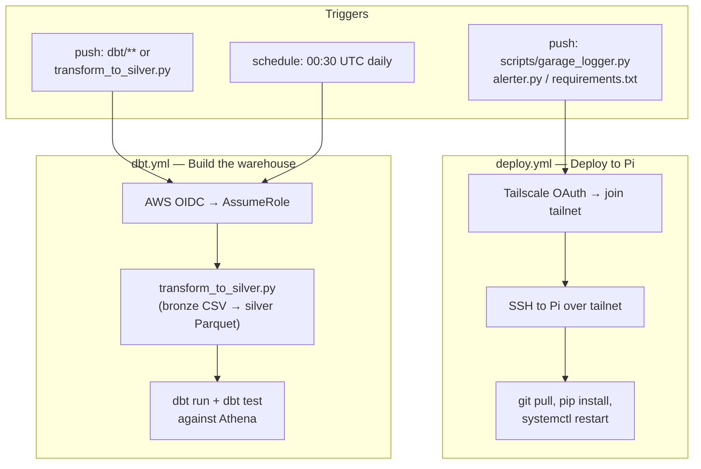

# CI/CD

Two GitHub Actions workflows automate the entire pipeline: one deploys Pi-side code to the Raspberry Pi sitting behind home-network NAT, and the other runs the daily silver transform plus the dbt build against AWS. Both avoid long-lived credentials — the Pi deploy uses Tailscale OAuth, the AWS workflow uses OIDC.



## `deploy.yml` — Deploy to the Pi

[`.github/workflows/deploy.yml`](../.github/workflows/deploy.yml). Triggers on pushes to any of:

- `scripts/garage_logger.py`
- `scripts/alerter.py`
- `scripts/export_to_s3.py`
- `requirements.txt`

…or manually via `workflow_dispatch`.

The interesting step is the first one — reaching a Raspberry Pi on a home network from a GitHub-hosted runner:

```yaml
- name: Connect to Tailscale
  uses: tailscale/github-action@v2
  with:
    oauth-client-id: ${{ secrets.TS_OAUTH_CLIENT_ID }}
    oauth-secret: ${{ secrets.TS_OAUTH_SECRET }}
    tags: tag:ci
```

Tailscale gives the runner an ephemeral identity inside the tailnet for the duration of the job. The Pi has a stable tailnet hostname (`garagepi.<tailnet>.ts.net`), so once the runner is on the tailnet, SSH "just works":

```yaml
- name: Deploy via SSH
  uses: appleboy/ssh-action@v1
  with:
    host: ${{ secrets.PI_SSH_HOST }}
    username: travismagaluk
    key: ${{ secrets.PI_SSH_KEY }}
    script: |
      set -euo pipefail
      cd /home/travismagaluk/garagewatch
      git pull origin main
      ./venv/bin/pip install -r requirements.txt --quiet
      sudo systemctl restart garage_logger
      sudo systemctl is-active --quiet garage_logger && echo "Service is active"
```

A few small but load-bearing details:

- **`set -euo pipefail`** — without it, a failed `git pull` followed by a successful `systemctl restart` would mark the job green. `pipefail` ensures the deploy fails loudly the moment any step does.
- **`./venv/bin/pip`** — the Pi uses a venv that the systemd service points at. Using the absolute path avoids accidentally installing into the system Python.
- **`systemctl is-active --quiet`** — the service might restart but immediately die if the new code has an import error. This line is a smoke test: it fails the workflow if the service isn't running 1 second after the restart.

**Why Tailscale over alternatives.** A traditional approach would be port-forwarding SSH on the home router and exposing the Pi to the public internet, or running a Cloudflare tunnel. Tailscale wins on three axes: nothing is exposed publicly (the tailnet is private), the auth is OAuth-scoped to CI (`tag:ci`) rather than a long-lived password or SSH key on the open internet, and there's no router configuration. The OAuth credentials can be rotated and tagged separately from any human user.

## `dbt.yml` — Build the warehouse

[`.github/workflows/dbt.yml`](../.github/workflows/dbt.yml). Triggers on:

- `push` to `main` that changes anything under `dbt/` or `scripts/transform_to_silver.py`
- `schedule: cron: '30 0 * * *'` — daily at 00:30 UTC, after the Pi's midnight export
- `workflow_dispatch`

The schedule and the path filter are both load-bearing. Path-triggered runs catch dbt code changes; the schedule catches the daily data refresh.

### Permissions and OIDC

```yaml
permissions:
  id-token: write
  contents: read
```

This is the unlock for AWS OIDC. `id-token: write` lets GitHub mint a JSON Web Token for the workflow run; `aws-actions/configure-aws-credentials` then exchanges that JWT for short-lived AWS credentials by calling `sts:AssumeRoleWithWebIdentity`:

```yaml
- name: Configure AWS credentials via OIDC
  uses: aws-actions/configure-aws-credentials@v4
  with:
    role-to-assume: ${{ secrets.AWS_ROLE_ARN }}
    aws-region: us-east-1
```

The AWS IAM role's trust policy is scoped to this repo and the `main` branch. No `AWS_ACCESS_KEY_ID` or `AWS_SECRET_ACCESS_KEY` lives in GitHub secrets — if the repo is ever compromised, there are no long-lived AWS credentials to steal. This is the modern way to wire CI to AWS, and it's worth knowing how to set up in an interview.

### dbt profile generated at runtime

```yaml
- name: Write dbt profiles
  run: |
    mkdir -p ~/.dbt
    cat > ~/.dbt/profiles.yml << 'EOF'
    garagewatch:
      target: athena
      outputs:
        athena:
          type: athena
          s3_staging_dir: s3://garagewatch-data/athena-results/
          region_name: us-east-1
          database: garagewatch_raw
          schema: garagewatch_analytics
          threads: 1
    EOF
```

The profile is written inline rather than committed. This keeps the secret-shaped configuration (region, bucket, schemas) out of the repo and ties the runtime configuration to the workflow that uses it.

### The four work steps

```yaml
- run: pip install dbt-athena-community pandas pyarrow
- run: python scripts/transform_to_silver.py
- working-directory: dbt
  run: dbt run --target athena
- working-directory: dbt
  run: dbt test --target athena
```

`dbt test` runs *after* `dbt run` — schema tests and the singular gap-detection test from [`dbt/tests/assert_no_recent_gaps.sql`](../dbt/tests/assert_no_recent_gaps.sql) all execute against the freshly built marts. A test failure fails the workflow loudly via GitHub's commit status; data-quality regressions don't ship silently.

## Why daily, not hourly

The dbt workflow used to run hourly. AWS billing showed an emerging overage on S3 Tier-1 requests (~2,700/month forecast against a 2,000 free-tier allowance). The fix was to reduce to a daily cadence — exhaustive analysis with the request math and a per-partition watermark refactor for `transform_to_silver.py` is in [`docs/learnings/s3-cost-optimization.md`](learnings/s3-cost-optimization.md).

## Webhook deploy — superseded

[`scripts/github_webhook.py`](../scripts/github_webhook.py) is a Flask HMAC-validated webhook receiver that was the original deploy mechanism. The flow was: GitHub fires a push webhook → Flask app on the Pi validates the SHA-256 HMAC → invokes `deploy.sh`.

The webhook is now superseded by `deploy.yml`. The Actions path wins on three counts:

- **Secrets centralisation.** All deploy credentials live in GitHub secrets, not on the Pi.
- **Audit log.** Every deploy is a workflow run with a permalink, logs, and a failure status. Webhook deploys would have produced a Flask log line on the Pi.
- **Fewer moving parts.** The Pi no longer needs to run a public-facing HTTPS endpoint, validate signatures, or manage a Flask process alongside the sensor logger.

The file remains in-tree as a reference implementation of HMAC signature verification — the kind of code someone might want to read when adding signed webhooks elsewhere. It is not loaded by any current systemd service.

## Future workflow ideas

- **Pull-request preview builds for dbt.** `dbt build --target ci` against a PR-scoped schema, then dropping the schema on PR close. The current setup only runs against `main`; a PR target would surface model-breaking changes pre-merge.
- **Slack/email notification on `dbt test` failure.** Currently visible only in the GitHub Actions UI.
- **A standalone source-freshness check** decoupled from `dbt run`, so the freshness SLA can fail loudly without waiting for the full mart build.
