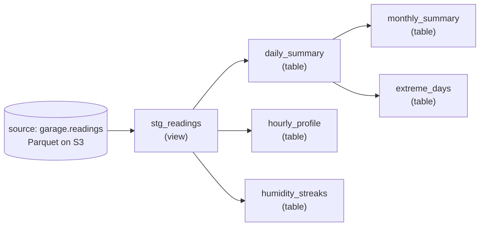

# dbt models

The gold layer of the pipeline is a small dbt project ([`dbt/`](../dbt)) using the `dbt-athena-community` adapter. It builds five mart tables on top of a single staging view, all sourced from one raw table (`garagewatch_raw.readings`) that Glue catalogues over the silver Parquet files in S3.

## Lineage



Both `monthly_summary` and `extreme_days` build on `daily_summary` rather than re-aggregating from `stg_readings` — fewer rows scanned per query, and the daily roll-up is the natural intermediate grain.

## Project configuration

[`dbt/dbt_project.yml`](../dbt/dbt_project.yml) sets two materialization defaults, one per directory:

```yaml
models:
  garagewatch:
    staging:
      +materialized: view
    marts:
      +materialized: table
```

Staging is always a view — it's cheap, always fresh, and never paid for at query time because Athena inlines the view definition. Marts are tables because the dashboard panels would otherwise pay to re-aggregate millions of rows on every refresh. Athena writes mart tables as Parquet under the workgroup's S3 staging directory.

## Source — `garage.readings`

Defined in [`dbt/models/sources.yml`](../dbt/models/sources.yml):

```yaml
sources:
  - name: garage
    database: awsdatacatalog
    schema: garagewatch_raw
    loaded_at_field: timestamp
    freshness:
      warn_after: {count: 2, period: hour}
      error_after: {count: 6, period: hour}
    tables:
      - name: readings
```

The freshness SLA catches silent sensor or pipeline failures. `dbt source freshness` queries `MAX(timestamp)` against the source — if the most recent reading is more than 6 hours old, the check fails. This is the first line of defence against "the dashboard looks fine because old data is still there."

## Staging — `stg_readings`

A view that does three things and nothing else:

1. **Types** every column with an explicit cast (`decimal(5,2)` for sensor values).
2. **Adds a localised timestamp** by converting UTC to `America/New_York` so downstream marts can group by local calendar day without each one repeating the timezone math.
3. **Filters physically impossible values** — temperatures outside `-20…60 °C`, humidity outside `0…100 %`, and null timestamps.

```sql
where temperature_c between -20 and 60
  and humidity_percent between 0 and 100
  and timestamp is not null
```

Every mart `ref('stg_readings')` — none reach into the raw source. Changing the cleaning rules in one place propagates everywhere.

## Marts

### `daily_summary`

One row per local calendar day with min / max / avg for temperature (F and C) and humidity, plus `reading_count` for sanity checks (1,440 expected readings per day at one-per-minute cadence).

Tested for `not_null` and `unique` on the `day` column ([`dbt/models/schema.yml`](../dbt/models/schema.yml)). The uniqueness test is the canary for double-counted partitions — if the silver merge ever lets a duplicate row through, `daily_summary` will fail to build with a uniqueness violation.

Used as the input for two downstream marts and as the source for the daily-range Grafana panels.

### `monthly_summary`

One row per calendar month with min / p25 / median / p75 / max / avg, computed via Athena's `approx_percentile`. The percentiles power the box-plot-style monthly distribution panel without paying for an exact percentile scan.

Worth knowing: Athena's `approx_percentile` is built on quantile sketches and is approximate by design. At the volume here (~44k readings/month) the error is negligible. At larger scale, exact percentiles would need a different strategy or an external library.

### `hourly_profile`

One row per `(month_num, hour_of_day)` — so at most 12 × 24 = 288 rows ever. Computes the average temperature and humidity for each hour-of-day grouped by month. This is the input for the seasonal heatmap: it makes patterns like "August evenings are humid" or "January mornings spike cold" visible at a glance.

The materialization here is almost a formality (288 rows would be fast as a view) but consistency with the other marts and the freedom to add tests later won out.

### `extreme_days`

Three ranked top-15 lists unioned together — coldest, hottest, and most humid days in the trailing 12 months — using `row_number() over (order by ...)`. Each ranking comes from `daily_summary`, not raw readings, so a single spurious 1-minute reading can't promote a day to "hottest."

The `category` and `rank` columns let a single panel filter on category and display in rank order.

### `humidity_streaks`

The most algorithmically interesting model. It applies the classic **gaps-and-islands** SQL pattern:

```sql
row_number() over (order by read_at_local)
  - row_number() over (partition by is_high order by read_at_local) as grp
```

The difference between two parallel row-numbers is constant within a continuous run of the same `is_high` flag — that constant becomes the streak identifier. Group on it, keep only the high-humidity groups, and you've collapsed millions of readings into a handful of streak rows. The model then filters to streaks of at least one hour and returns the top 50 by duration.

Reading: Itzik Ben-Gan's writing on gaps-and-islands is the canonical reference; this is the textbook application.

## Tests

Column tests are declared in [`dbt/models/schema.yml`](../dbt/models/schema.yml) — `not_null` on every staging column and on primary-key-equivalent columns in `daily_summary` and `monthly_summary`, plus `unique` on those primary keys.

A singular test in [`dbt/tests/assert_no_recent_gaps.sql`](../dbt/tests/assert_no_recent_gaps.sql) catches sensor downtime by failing whenever two consecutive readings in the last 7 days are more than 2 hours apart:

```sql
where next_read - read_at_utc > interval '2' hour
```

This is the second line of defence after source freshness. Freshness asks "did *any* row arrive recently?" — the gap test asks "did rows arrive *continuously*?" A logger that died at 3 AM and recovered at noon would pass freshness but fail this test.

Full data-quality walkthrough: [`docs/data-quality.md`](data-quality.md).

## Running locally

The repo can be inspected without an AWS account — `dbt compile` renders the Jinja and shows the actual SQL each model produces, and `dbt docs generate && dbt docs serve` opens a browsable lineage graph at `localhost:8080`:

```bash
cd dbt
pip install dbt-athena-community
dbt compile
dbt docs generate && dbt docs serve
```

Actually running the models needs AWS credentials (or the CI workflow at [`.github/workflows/dbt.yml`](../.github/workflows/dbt.yml)) — see [`docs/cicd.md`](cicd.md).
